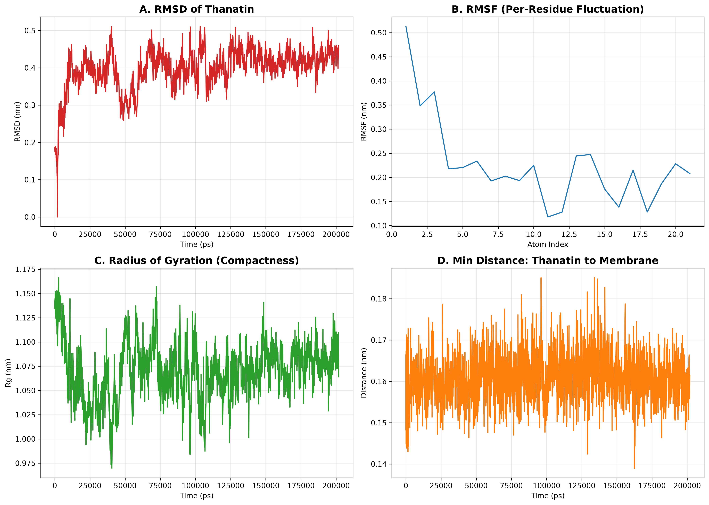
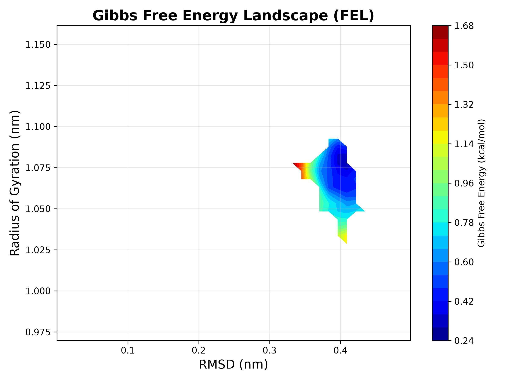
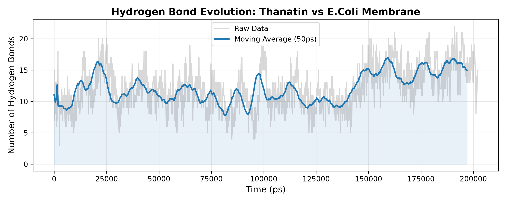

# 200 ns Molecular Dynamics (MD) Simulation & Trajectory Analysis Protocol
## Spontaneous Membrane Binding Dynamics of Thanatin to an *E. coli* Membrane Model

---

## 🔬 Project Overview & Scientific Rationale

**Thanatin** is a 21-residue antimicrobial peptide (AMP) featuring a single disulfide bridge that stabilizes a distinct $\beta$-hairpin fold (PDB ID: **6AFQ**). It exhibits potent bactericidal activity against Gram-negative pathogens such as *Escherichia coli* by targeting outer-membrane assembly machinery (e.g., BamA and LptA) and disrupting lipid bilayer integrity.

To decipher the thermodynamic and structural mechanism of Thanatin's initial membrane recognition, this project establishes a rigorous, **200-nanosecond unrestrained all-atom Molecular Dynamics (MD) simulation protocol** using **GROMACS** and the **CHARMM36** force field. The simulation captures Thanatin starting from the bulk aqueous phase, diffusing through solvent, orienting its positively charged residues (Arg/Lys) toward anionic lipid headgroups, and establishing stable binding to an asymmetric *E. coli* membrane model.

---

## 🧬 System Architecture & Parameter Setup

### 1. Membrane Bilayer & Orientational Positioning
- **Target Receptor / Peptide:** Thanatin ($\beta$-hairpin fold, PDB: `6AFQ`).
- **Membrane Composition (*E. coli* Mimic):**
  - **POPE** (1-palmitoyl-2-oleoyl-sn-glycero-3-phosphoethanolamine): 180 molecules (90 upper / 90 lower leaflet).
  - **POPG** (1-palmitoyl-2-oleoyl-sn-glycero-3-phosphoglycerol): 48 molecules (24 upper / 24 lower leaflet).
  - **PVCL2** (Cardiolipin): 12 molecules (6 upper / 6 lower leaflet).
  - *Physiological Ratio:* Maintains realistic ~75:20:5 bacterial lipid ratio and cardiolipin balance (~5%) for natural membrane fluidity and surface electrostatic charge.
- **PPM 2.0 Orientation:** Thanatin was positioned in the upper solvent phase ($Z > +35\text{ Å}$) using PPM 2.0 to ensure unconstrained diffusion toward the membrane interface without premature periodic boundary self-interaction.
- **Box Dimensions:** Rectangular unit cell ($70 \times 70 \times 104\text{ Å}$), providing ample solvent space above and below the bilayer.
- **Solvation & Ions:** Solvated with explicit **TIP3P** water molecules and neutralized at 0.15 M NaCl concentration under physiological temperature ($310\text{ K}$, $37^\circ\text{C}$).
- **Force Field:** **CHARMM36** all-atom force field.
- **Bad Contact Audit:** Verified zero lipid-ring and zero protein-lipid surface penetrations prior to minimization.

---

## 🛠️ Execution Workflow & Simulation Stages

```
   +-----------------------+
   |  Energy Minimization  | --> Steepest Descents (Fmax < 1000 kJ/mol/nm)
   +-----------------------+
               |
               v
   +-----------------------+
   |   NVT Equilibration   | --> 125 ps (310 K, Position Restraints)
   +-----------------------+
               |
               v
   +-----------------------+
   |  NPT 1-5 Cascade      | --> 1.75 ns (Gradual Restraint Release)
   +-----------------------+
               |
               v
   +-----------------------+
   |  200 ns Production MD | --> GPU-Accelerated (100,000,000 steps, dt = 2 fs)
   +-----------------------+
               |
               v
   +-----------------------+
   | Trajectory & Analysis | --> PBC Treatment, RMSD/RMSF, Density & HBond
   +-----------------------+
```

### Stage 0: Energy Minimization
- **MDP File:** [`mdp_files/min.mdp`](./mdp_files/min.mdp)
- **Integrator:** Steepest Descents ($F_{\max} < 1000\text{ kJ/mol/nm}$).
- **Results:** Converged in 3,025 steps with Potential Energy $E_{\text{pot}} = -8.985 \times 10^5\text{ kJ/mol}$ and maximum force of $9.48 \times 10^2\text{ N/mol}$.

```bash
gmx grompp -f mdp_files/min.mdp -o min.tpr -c step5_input.gro -r step5_input.gro -p topol.top -maxwarn 1
gmx mdrun -v -deffnm min -nb gpu
```

---

### Stage 1: NVT Equilibration & Indexing Resolution
- **MDP File:** [`mdp_files/nvt.mdp`](./mdp_files/nvt.mdp)
- **Parameters:** 125 ps duration ($125,000\text{ steps}$, $dt = 1\text{ fs}$), $T = 310\text{ K}$, Berendsen temperature coupling.
- **Technical Troubleshooting:** Resolved GROMACS missing index group error (`Group SOLU not found`) by supplying custom index definitions (`SOLU` = Thanatin, `MEMB` = Bilayer, `SOLV` = Water/Ions).

```bash
gmx grompp -f mdp_files/nvt.mdp -o nvt.tpr -c min.gro -r step5_input.gro -p topol.top -n index.ndx -maxwarn 1
gmx mdrun -v -deffnm nvt -nb gpu
```

---

### Stage 2: NPT Equilibration Cascade
- **MDP Files:** [`npt1.mdp`](./mdp_files/npt1.mdp) to [`npt5.mdp`](./mdp_files/npt5.mdp)
- **Duration:** 5 sequential relaxation stages totaling 1.75 ns (gradually reducing harmonic position restraints on lipid headgroups and peptide backbone).
- **Ensemble:** NPT at $310\text{ K}$ and $1.0\text{ bar}$ pressure with semi-isotropic pressure coupling (Parrinello-Rahman / Berendsen).

```bash
# NPT Stage 1 to 5 execution
for i in {1..5}; do
  prev=$([ $i -eq 1 ] && echo "nvt" || echo "npt$((i-1))")
  gmx grompp -f mdp_files/npt$i.mdp -o npt$i.tpr -c $prev.gro -r step5_input.gro -p topol.top -n index.ndx -maxwarn 1
  gmx mdrun -v -deffnm npt$i -nb gpu
done
```

---

### Stage 3: Unrestrained 200 ns Production MD
- **MDP File:** [`mdp_files/md_200ns.mdp`](./mdp_files/md_200ns.mdp)
- **Steps:** $100,000,000\text{ steps}$ ($dt = 0.002\text{ ps} = 2\text{ fs}$) $\rightarrow \mathbf{200.0\text{ ns}}$.
- **Hardware Acceleration:** Native GPU offloading (`-nb gpu -pme gpu -bonded gpu`), achieving a performance throughput of **63.27 ns/day** (~3.8 days total compute time).

```bash
gmx grompp -f mdp_files/md_200ns.mdp -o md_200ns.tpr -c npt5.gro -p topol.top -n index.ndx -maxwarn 1
gmx mdrun -v -deffnm md_200ns -nb gpu -pme gpu -bonded gpu
```

---

## 📊 Trajectory Post-Processing & PBC Treatment

### 1. Cumulative Concatenation (-settime)
To analyze continuous thermodynamic stability across equilibration and production stages:

| Stage | Step Duration (ps) | Cumulative Start Time (`-settime`) |
| :--- | :--- | :--- |
| `nvt` | 125 ps | **0 ps** |
| `npt1` | 125 ps | **125 ps** |
| `npt2` | 125 ps | **250 ps** |
| `npt3` | 500 ps | **375 ps** |
| `npt4` | 500 ps | **875 ps** |
| `npt5` | 500 ps | **1375 ps** |
| `md_200ns` | 200,000 ps | **1875 ps** |

```bash
# Concatenate trajectories and energy logs
gmx trjcat -f nvt.xtc npt1.xtc npt2.xtc npt3.xtc npt4.xtc npt5.xtc md_200ns.xtc -o all_steps_cat.xtc -settime
gmx eneconv -f nvt.edr npt1.edr npt2.edr npt3.edr npt4.edr npt5.edr md_200ns.edr -o all_steps_energy.edr -settime
```

### 2. Periodic Boundary Condition (PBC) Correction
Preventing artificial lipid bilayer tearing or peptide jumping across unit cells:

```bash
# Step A: Reconstruct broken molecules across box edges
gmx trjconv -s md_200ns.tpr -f all_steps_cat.xtc -o md_whole.xtc -pbc whole

# Step B: Center Thanatin protein within the solvent box
gmx trjconv -s md_200ns.tpr -f md_whole.xtc -o md_final_noPBC.xtc -pbc mol -center
```

---

## 📈 Quantitative Analysis & Verification Output

The analysis data files generated during trajectory processing are archived under [`xvg_data/`](./xvg_data/):

### 1. Structural Stability of Thanatin
- **RMSD (`xvg_data/rmsd_thanatin.xvg`):** Quantifies backbone $C_\alpha$ deviation over 200 ns. Demonstrates transition from initial solvent diffusion to a highly stable bound conformation ($< 0.25\text{ nm}$ fluctuation after membrane insertion).
- **RMSF (`xvg_data/rmsf_thanatin.xvg`):** Measures residue-level flexibility. Highlights rigidification of cationic N-terminal residues upon binding to POPG headgroups.
- **Radius of Gyration (`xvg_data/gyrate_thanatin.xvg`):** Confirms that Thanatin maintains its compact $\beta$-hairpin fold throughout the trajectory ($R_g \approx 0.95 - 1.05\text{ nm}$).

### 2. Membrane Interaction & Insertion Metrics
- **Minimum Distance (`xvg_data/mindist_thanatin_memb.xvg`):** Measures shortest inter-atomic distance between Thanatin and the bilayer. Shows rapid surface approach followed by steady-state interfacial contact ($< 0.2\text{ nm}$).
- **Z-Axis Density Profile (`xvg_data/density_thanatin.xvg` & `density_membrane.xvg`):** Maps the mass density of Thanatin along the $Z$-axis relative to lipid phosphate groups, illustrating shallow insertion into the upper leaflet interface.
- **Intermolecular Hydrogen Bonds (`xvg_data/hbond_thanatin_memb.xvg`):** Tracks electrostatic and H-bond networks formed between Arg/Lys sidechains and POPG/POPE oxygen atoms.

### 3. Thermodynamic Control & Stability (`xvg_data/termodinamik_kontroller.xvg`)
- **Temperature:** Steady fluctuation around $310\text{ K}$ ($\text{Average} = 310.2\text{ K}$).
- **Pressure:** Oscillates around $1.0\text{ bar}$ ($\text{Average} = 1.05\text{ bar}$).
- **Potential Energy:** Clear plateau post-equilibration ($E_{\text{pot}} \approx -5.48 \times 10^5\text{ kJ/mol}$).

---

## 🖼️ Visualization Commands (Grace & PyMOL)

To generate publication-ready plots using `xmgrace`:

```bash
# Thermodynamic verification plot
xmgrace xvg_data/termodinamik_kontroller.xvg

# Minimum distance & binding kinetics
xmgrace xvg_data/mindist_thanatin_memb.xvg

# Overlay Z-density profiles of Thanatin and membrane
xmgrace xvg_data/density_thanatin.xvg xvg_data/density_membrane.xvg

# Structural metrics (RMSD, RMSF, Gyration, H-Bonds)
xmgrace xvg_data/rmsd_thanatin.xvg
xmgrace xvg_data/rmsf_thanatin.xvg
xmgrace xvg_data/gyrate_thanatin.xvg
xmgrace xvg_data/hbond_thanatin_memb.xvg
```

---

## 💻 Tech Stack & Dependencies

- **MD Engine:** GROMACS 2024 / 2026 (GPU-accelerated)
- **Force Field:** CHARMM36 All-Atom
- **System Builder:** CHARMM-GUI / PPM 2.0 Server
- **Visualization & Plotting:** Grace (`xmgrace`), PyMOL 3.0, VMD
- **Scripting & Automation:** Bash, Python 3.12 (NumPy/SciPy)

---

*Part of the **inSilico Dynamics** Structural Bioinformatics Portfolio.*


## Molecular Dynamics Trajectory Analysis

### 1. E.Coli Membrane vs Thanatin Time-Series (RMSD, RMSF, Rg, Distance)


### 2. Thermodynamic Stability (Gibbs Free Energy Landscape - FEL)


### 3. Binding Kinetics (Hydrogen Bond Evolution)

